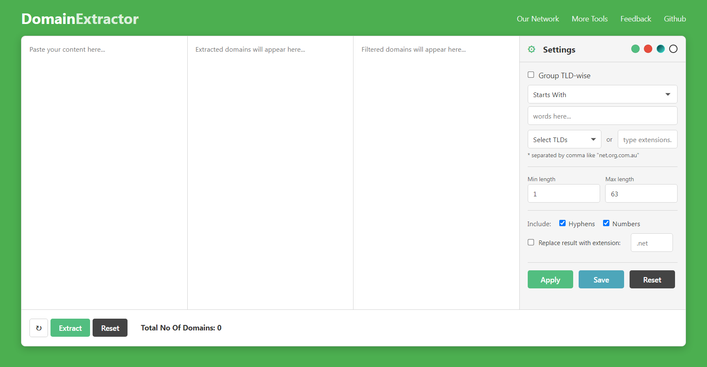

# Domain Extractor

A robust, privacy-focused, client-side tool for extracting domain names from unstructured text. Built with a focus on security, performance, and usability.

  

## Features

* **Bulk Extraction:** Paste massive blocks of messy text; the tool uses advanced Regex to identify valid domains while ignoring common file extensions (e.g., .jpg, .png, .exe).
* **Smart Filtering:**
    * **Word Filter:** Filter by "Contains," "Starts with," or "Ends with."
    * **TLD Filter:** Isolate specific extensions (e.g., `.com`, `.org`, `.co.uk`).
    * **Length Control:** Set minimum and maximum character limits.
    * **Pattern Matching:** Include or exclude domains containing numbers or hyphens.
* **Data Transformation:**
    * **Group TLD-wise:** Automatically categorize results by their extension.
    * **Extension Replacement:** Mass-replace TLDs (e.g., change all results to `.net`).
* **Export Options:** One-click Copy to Clipboard, or export to `.csv` / `.txt`.
* **Responsive UI:** Fully functional on desktop and mobile devices.
* **Theming:** Includes a toggle for Light (Outline) and Dark modes.
* **Persistence:** Automatically saves your filter settings preferences to LocalStorage.

## Security & Privacy

* **Client-Side Only:** This tool runs entirely in your browser using Vanilla JavaScript. **No data is ever sent to a server.**
* **Content Security Policy (CSP):** Includes strict CSP headers to prevent XSS and script injection attacks.
* **Sanitized Inputs:** Protects against CSV injection and reverse tabnabbing on external links.

## How to Use

1.  **Download:** Clone this repository or download the `index.html` file.
2.  **Run:** Simply double-click `index.html` to open it in any modern web browser. No installation or local server required.

### Example Workflow
1.  Paste a paragraph of text containing URLs or email addresses into the first box.
2.  Click **Extract**. Valid domains will appear in the second box.
3.  Adjust settings in the right sidebar (e.g., "Select TLDs: .com").
4.  Click **Apply** to see refined results in the third box.
5.  Click **CSV** to download your list.

## Tech Stack

* **HTML5**
* **CSS3** (CSS Variables for theming, Flexbox/Grid for layout)
* **JavaScript** (ES6+)

## License

This project is open source and available under the [MIT License](LICENSE).
